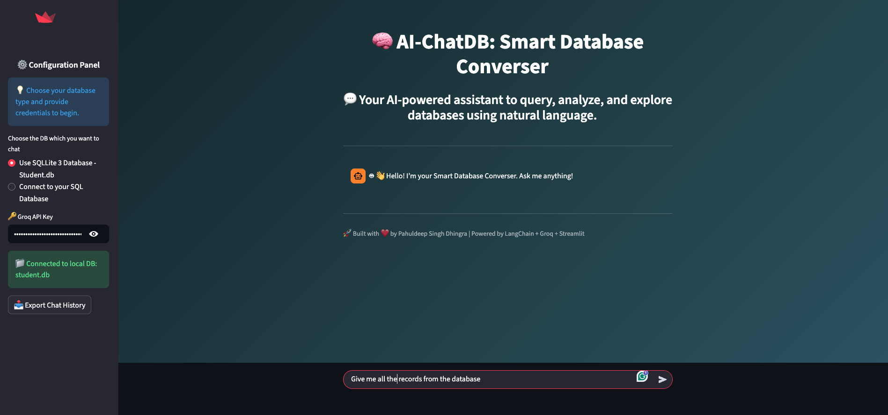
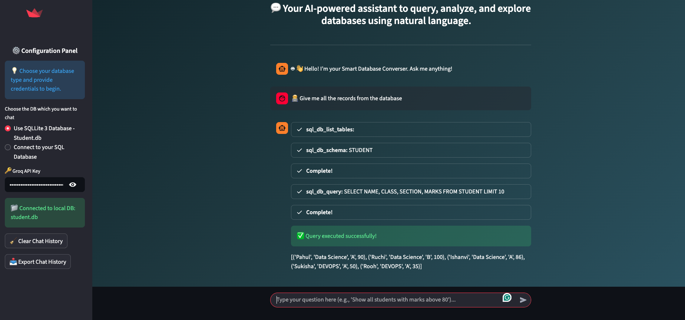

# 🧠 AI-ChatDB: Smart Database Converser

> A LangChain + Groq-powered Streamlit application that lets you **chat directly with your databases** using natural language.  
> Query, analyze, and explore MySQL or SQLite databases without writing a single SQL command.

---

## 🖼️ Screenshots

| Interface | Description |
|:--|:--|
|  | Streamlit interface showing conversation with database |
|  | Output Page after running the query|


---

## 🚀 Features

- 🧩 **Multi-Database Support:** Connects seamlessly to both SQLite and MySQL.
- 🤖 **LLM-Powered Agent:** Uses Groq’s **Llama-3.3-70B Versatile** model for intelligent SQL generation.
- 🪶 **Streamlit Chat UI:** Clean and modern chat interface with real-time interaction.
- ⚙️ **Dynamic Configuration:** Switch between databases from the sidebar instantly.
- 💬 **Export Chat History:** Download previous conversations as a JSON file.
- 🔥 **Agentic Reasoning:** Powered by `create_sql_agent` and LangChain’s `SQLDatabaseToolkit`.

---

## 🧠 Tech Stack

| Category | Technologies |
|:--|:--|
| Frontend | Streamlit |
| LLM Engine | Groq Llama-3.3-70B |
| Framework | LangChain, LangChain-Groq |
| Database | SQLite 3, MySQL |
| ORM / Connector | SQLAlchemy |
| Others | Python 3.8+, JSON, Caching |

---

## 🏗️ Project Structure

```bash
├── app.py # Main Streamlit application
├── sqlite.py # SQLite database helper
├── student.db # Local SQLite database file
├── requirements.txt # Dependencies list
├── images/ # App demo
├── .gitignore
└── README.md
```

---

## 🧩 How to Run Locally

```bash
# Clone the repository
git clone https://github.com/pahul1712/AI-ChatDB-Smart-Database-Converser.git

# Navigate to the directory
cd AI-ChatDB-Smart-Database-Converser

# Install dependencies
pip install -r requirements.txt

# Run the app
streamlit run app.py
```

## 🧰 Example Query Prompts

- “Show me all students from Class 10 with marks above 85.”
- “List all tables available in the database.”
- “Find the average marks by section.”
- “Add a record for a new student named John Doe in Class 12.”

---

## 🧑‍💻 Author

- Pahuldeep Singh Dhingra
- Graduate Teaching Assistant • MS Data Science & Analytics •  Florida Atlantic University
- email: [✉️ Email](pahuldeepsingh531@gmail.com) • [🔗 LinkedIn](https://www.linkedin.com/in/pahuldeepsing/)

